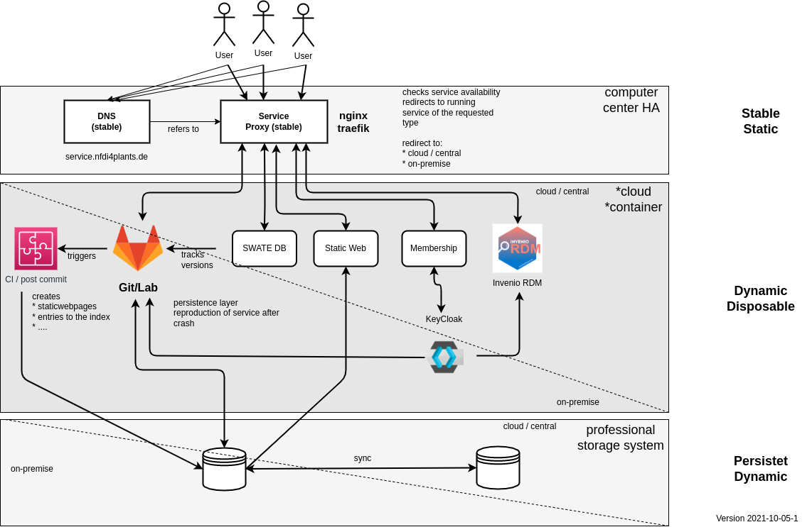

Fortunately the pandemic situation allowed for a three day in-person meeting for a review of DataPLANT after year one. As other consortia we were not able to completely staff all posts by then and needed to review the work plan to adapt to ongoing developments and insights gathered over the first year. Thus we reviewed of basic infrastructure considerations and adhered to the feedback from the Senior Management Board meeting to emphasize the priority of community services. In terms of the project's mid-term review we decided to focus on the specific assets and highlights of the project. First working tools and services evolved around metadata annotation and DataPLANT ontology development through Swate and Swobup. The tools around Swate/Swobup need a stable infrastructure when promotion of the services to the community picks up speed. The ARC specification is under way and GitLab is getting thoroughly tested. Insights regarding typical workflows in the community were gathered and applied to storage and processing of data (to offer both local, on-premise and cloud storage).

{width=50%}

Further considerations regarding further development focused the to be maintained compatibility with the NFDI regarding AAI and common platforms (and basic services). This means that DataPLANT does not necessarly sets up own large infrastructures in a monolithic form, but prefers microservices and an agile approach. The services should be as easy to maintain as possible as well as being potentially interchangeable. Regarding the software base DataPLANT will rely on broadly deployed, established base software used by many other scientific communities like GitLab or Invenio. It takes the considerations on the sometimes tight staffing situation as well as the qualifications of the existing personnel into account. In general we aim to avoidance too complex structures that are difficult to integrate later on and ensure reliable operation.

A major task is the finalization of the ARC specification including its relation to Research Object Crates (RO-Crate) and FAIR digital objects (FDO). The final review uses the GitHub pull-request mechanism and the resulting first version will be presented to the relevant boards, at the same time dissemination to the key participants.

Regarding decision-making processes it was clarified that the task areas
1 and 2 primarily focus on the "how" and to concentrate in the regular meetings on respective task area cores. The task area 3 aims on the facilitation between "what do you want" (community wishes and input) to the "how"?

GitLab is getting focused on for versioning and sharing as it is an established tool where much expertise already exists and as a way to complement existing project repositories and services at GitHub. It well get established as a central tool with many functions of an intended science gateway plus further services, like static website, data backend for Swate. It will partially offer the functionality of a science gateway for DataPLANT from which a range of services will be accessible.
The future infrastructure will rely on a fixed (regarding service host names), stable entry point but allowing the inclusion or alternative of local resources. The envisioned model can incorporate different clouds or similar resources and dynamically handle states of unavailability.
The persistence is achieved through professional backend storage systems.

