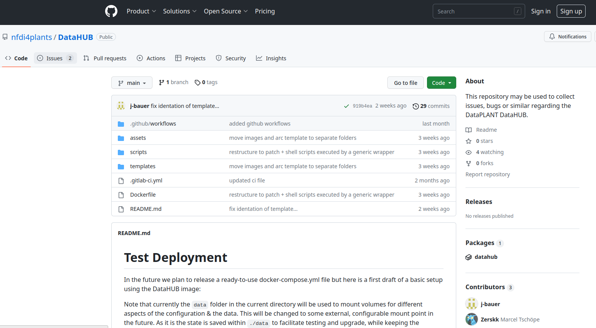

The [DataPLANT DataHUB](https://git.nfdi4plants.org/explore) as a science gateway is primarily backed by the open source GitLab framework. It provides an entry point to our various services, starting with a versioned, generated web page and additional modules for community interaction. The DataHUB platform is where the DataPLANT Annotated Research Contexts ([ARCs](https://doi.org/10.11588/heibooks.979.c13751)) evolve to a certain state. This can be done either on the central DataPLANT instance or on various on premise installations. To allow more sites to join the DataHUB federation, we created a Docker image to ease the on-premise installation. The package is available like other [DataPLANT tools](https://github.com/nfdi4plants) on [GitHub](https://github.com/nfdi4plants/DataHUB).   

[{width=60%; align-items: center}](https://github.com/nfdi4plants/DataHUB)

Storage resources are used for both keeping the necessary service configurations and user data. Depending on the service provided locally, storage resources may be provided in the form of traditional network file systems such as NFS or SMB, or as object storage. The on-premise storage has to implement the necessary redundancy to keep user data secure to the required level. An authentication instance is required for authentication of users and the services behind them. The DataPLANT [user management](https://auth.nfdi4plants.org/realms/dataplant/protocol/openid-connect/auth?client_id=account&redirect_uri=https%3A%2F%2Fauth.nfdi4plants.org%2Frealms%2Fdataplant%2Faccount%2Flogin-redirect&state=0%2F9e672a18-002d-4fdc-a6cc-a3c64e64f9cd&response_type=code&scope=openid) builds on existing AAIs. Well established services such as Life Sciences AAI and ORCID can be combined with local authentication within the central DataPLANT authentication service. The infrastructure relies on KeyCloak, which supports modern authentication protocols like OpenID Connect and SAML, allowing the integration of multiple AAIs and identity brokering. It is possible to assign different roles depending on the source of the account or specific attributes. Permissions can be derived from these roles to differentiate between users. These range from privileged users with full access to the data and the ability to create archives/publications, to users who only have a reporting function and/or read-only access to raw data. All of this is at an early stage and will need to be refined through more productive use of the infrastructure. 

  
**Links**  
[DataPLANT DataHUB](https://git.nfdi4plants.org/explore)  
[On Premise DataHUB Service](https://github.com/nfdi4plants/DataHUB)  
[DataHUB Account Management](https://auth.nfdi4plants.org/realms/dataplant/protocol/openid-connect/auth?client_id=account&redirect_uri=https%3A%2F%2Fauth.nfdi4plants.org%2Frealms%2Fdataplant%2Faccount%2Flogin-redirect&state=0%2F9e672a18-002d-4fdc-a6cc-a3c64e64f9cd&response_type=code&scope=openid)  
[Knowledge Base Article - DataHUB](https://nfdi4plants.org/nfdi4plants.knowledgebase/docs/implementation/DataHub.html)  
[Knowledge Base Article - ARC](https://nfdi4plants.org/nfdi4plants.knowledgebase/docs/implementation/AnnotatedResearchContext.html)  