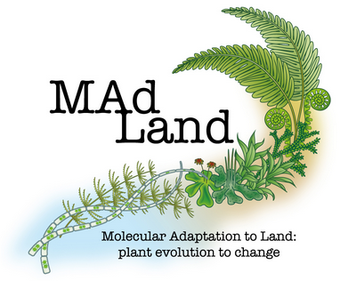
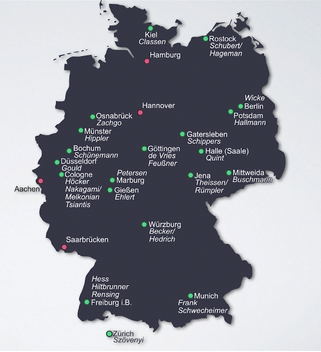
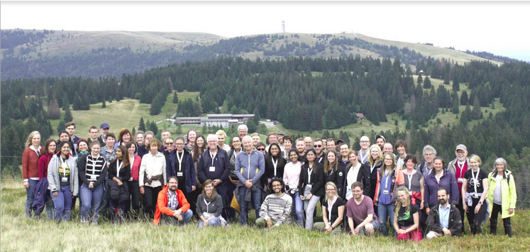

{: style="float:right"}

[MAdLand](https://madland.science) (**M**olecular **Ad**aptation to **Land**) is a DFG-priority programme research consortium exploring the molecular mechanism behind the transition of plant life from water to land, from alga to land plants. The first funding period ran from 2019 to 2023, and a second funding period is now underway (2024-2026).

MAdLand is committed to support and promote FAIRification of all research data generated within its projects, through the use of comprehensive research data management (RDM) strategies for the effective acquisition, processing, archival, and sharing of research data sets.

To this end, the MAdLand project (represented by [Prof. Dr. Stefan A. Rensing](https://uni-freiburg.de/universitaet/organisation-und-verwaltung/rektorat/prorektorat-fuer-forschung-und-innovation/), University of Freiburg) and DataPLANT (represented by its speaker) previously [signed a *Memorandum of Understanding*](https://nfdi4plants.org/content/news/2022-07-08-madland-and-dataplant-signed-a-memorandum-of-understanding.html) on joint collaboration in research data management in fundamental plant research.

{: style="float:left; margin-right:1em"}

As part of this mission, MAdLand is committed to create [ARCs](https://nfdi4plants.org/content/learn-more/annotated-research-context.html) for each of its centrally funded projects. Several ARCs for phase 1 projects have already been [published](https://archive.nfdi4plants.org/search?q=&l=list&p=1&s=10&sort=newest), with several more ARCs set to be released in the coming months. Furthermore, MAdLand aims to train all researchers of phase 2 projects in the skills required to create ARCs for their project at the 2024 MAdLand annual meeting. This training will introduce not only the concept of ARCs, but also provide practical instructions on how to make use of the DataPLANT tooling around ARCs such as [ARC commander](https://nfdi4plants.org/nfdi4plants.knowledgebase/docs/ArcCommanderManual/index.html) and [ARCitect](https://nfdi4plants.org/nfdi4plants.knowledgebase/docs/ARCitect-Manual/index.html) for the provisioning of ARCs, and the [SWATE Excel plugin](https://nfdi4plants.org/nfdi4plants.knowledgebase/docs/implementation/Swate.html) for the easy creation of ontology-based structured metadata of research activities, including descriptions of samples, experiments and assays.

As a further part of its collaboration with DataPLANT, MAdLand has developed and made freely available a set of (plant) community web-based resources. For example, the MAdLand **“Genome Zoo”** provides a protein sequence Database for fully sequenced plant and algal genomes, with a particular emphasis on non-seed plants and streptophyte algae. This database contains over 21 million sequences, representing a diverse group of more than 600 species. Additionally, **TAPscan** is a MAdLand resource for genome-wide annotation and warehousing of transcription associated proteins (TAPs) such as transcription factors and transcriptional regulators. TAPscan encompasses both an annotation tool for classification of protein sequences (both standalone and Galaxy-based tool), as well as a data warehouse where all TAPs detected in the MAdLand Genome Zoo can be interactively explored. The current [TAPscan warehouse (version 3)](https://plantcode.cup.uni-freiburg.de/tapscan/) will soon be replaced by [TAPscan v4](http://tapscan.plantcode.cup.uni-freiburg.de) (currently in beta).

Through these combined efforts, MAdLand aims to fully FAIRify the research data and knowledge generated in its various projects and thereby promote open and reproducible science.

